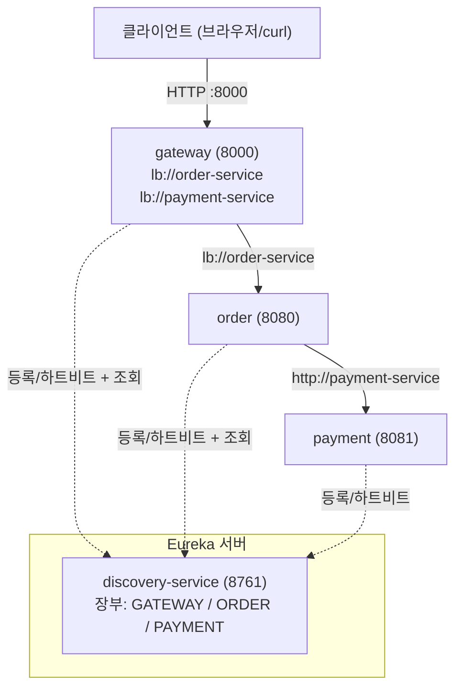

# 서비스 디스커버리 (Service Discovery) — Eureka

> ## ⚠️ 이 문서는 **역사 기록**입니다 — Eureka 는 Phase 16b 에서 삭제됐습니다
>
> `services/discovery-service` 모듈과 각 서비스의 `eureka-client` 의존성은 **더 이상 존재하지 않습니다.**
> 그 일을 이제 **플랫폼이** 합니다 — compose 네트워크의 DNS, k8s 의 Service + kube-proxy.
> 호출도 `lb://order-service` 가 아니라 평범한 URL(`http://order-service:8080`)입니다.
>
> **그래도 이 문서를 남기는 이유**: "왜 Phase 4 에는 이게 필요했나"를 알아야
> Phase 16 의 "디스커버리가 앱에서 플랫폼으로 넘어갔다"가 무슨 뜻인지 이해할 수 있기 때문입니다.
> 무엇을 잃고 무엇을 얻었는지(요청 단위 vs 커넥션 단위 부하분산 등)는
> [Phase 16 §12](PHASE-16-KUBERNETES.md#12-eureka-를-지운다는-것) 의 비교표를 보세요.
>
> ⚠️ 아래의 실행 명령(`:services:discovery-service:bootRun`, `localhost:8761` 등)은 **지금은 동작하지 않습니다.**

> **이 문서는 Phase 4 작업을 설명합니다.** 처음 보는 사람이 "왜 이게 필요하고, 무엇이, 어떻게
> 동작하는지"를 끝까지 이해하도록 개념 → 그림 → 이 프로젝트의 실제 코드/설정 → 동작 원리 →
> 검증 → 한계 순으로 정리했습니다.
>
> (본문의 코드/설정 블록은 핵심만 보여주는 **발췌**이며, 실제 파일과 다를 수 있습니다. 해설은
> 작업을 마친 뒤 되짚어 정리한 **회고형** 설명입니다.)

---

## 0. 한 줄 요약

> **"어디(host:port)"로 부르던 것을 "누구(서비스 이름)"로 부르게 바꿨다.**
> 서비스들은 부팅하면 자기 이름을 **레지스트리(Eureka)** 에 등록하고, 호출하는 쪽은
> 레지스트리에 "`payment-service` 어디 있어?"라고 물어 실제 주소를 받아 호출한다.

---

## 1. 왜 필요한가? (Phase 3까지의 문제)

> **먼저 알아둘 용어 — 게이트웨이(API Gateway).** 모든 외부 요청이 가장 먼저 거쳐가는 **단일
> 진입점**이다. 들어온 요청의 경로(URL Path)를 보고 "이건 order-service로, 저건 payment-service로"
> 하는 식으로 내부 서비스에 **라우팅(routing, 요청 전달)** 한다. 클라이언트는 내부 서비스 주소를
> 몰라도 게이트웨이 주소 하나만 알면 된다. (Phase 3에서 도입 — 자세한 내용은
> [PHASE-3-GATEWAY.md](PHASE-3-GATEWAY.md) 참고.)

Phase 3까지 서비스 주소가 **소스/설정에 하드코딩**되어 있었다.

```yaml
# (이전) 게이트웨이 라우트
uri: http://localhost:8080      # order-service
uri: http://localhost:8081      # payment-service
```
```yaml
# (이전) order-service → payment-service 호출 주소
payment:
  service:
    url: http://localhost:8081
```

이게 왜 문제일까? MSA의 현실은 다음과 같다.

- **인스턴스가 여러 개**가 된다. payment-service를 부하 때문에 3개 띄우면 주소가 3개다.
  하드코딩으론 표현 불가.
- **주소가 계속 바뀐다.** 컨테이너/쿠버네티스에서는 재배포할 때마다 IP·포트가 달라진다.
  배포할 때마다 설정을 고쳐야 한다면 자동화가 불가능하다.
- **죽고 살아난다.** 인스턴스가 죽으면 그 주소로 보내면 안 되고, 새로 뜬 인스턴스는
  자동으로 호출 대상에 포함돼야 한다.

즉 **"호출하는 쪽이 호출 대상의 물리적 위치를 미리 알고 있어야 한다"** 는 전제가 깨진다.
이 문제를 푸는 게 **서비스 디스커버리**다.

---

## 2. 핵심 개념

### 2.1 서비스 레지스트리(Service Registry)

전화번호부와 같다. **"서비스 이름 → 현재 살아있는 인스턴스들의 주소 목록"** 을 들고 있는 중앙 장부.
이 프로젝트에서는 **Netflix Eureka**가 그 역할을 한다(= `discovery-service`, 포트 8761).

장부에는 4가지 동작이 있다.

| 동작 | 주체 | 설명 |
|---|---|---|
| **등록(register)** | 각 서비스 | 부팅하면 "나는 `order-service`, 주소는 localhost:8080" 이라고 장부에 적는다 |
| **하트비트(heartbeat/renew)** | 각 서비스 | 기본 30초마다 "나 아직 살아있어"를 보낸다(lease 갱신) |
| **조회(fetch/discovery)** | 호출하는 쪽 | 장부 사본을 받아 캐싱(기본 30초마다 갱신). "payment-service 주소 목록 줘" |
| **해제(cancel/evict)** | 서비스 or 서버 | 정상 종료 시 스스로 빠지고, 하트비트가 일정 시간(기본 90초) 끊기면 서버가 강제로 지운다 |

### 2.2 클라이언트 사이드 vs 서버 사이드 디스커버리

로드밸런싱(여러 인스턴스 중 하나 고르기)을 **누가** 하느냐의 차이다.

```
[서버 사이드]  클라이언트 → (로드밸런서/프록시) → 인스턴스 중 하나
              예: AWS ELB, 쿠버네티스 Service. 호출자는 LB 주소 하나만 안다.

[클라이언트 사이드]  클라이언트가 레지스트리에서 목록을 받아 → 자기가 직접 하나 고름 → 인스턴스
              예: Eureka + Spring Cloud LoadBalancer.  ← 이 프로젝트가 쓰는 방식
```

이 프로젝트는 **클라이언트 사이드**다.
- **게이트웨이**가 `order-service`의 인스턴스 목록을 받아 직접 하나 골라 호출한다.
- **order-service**가 `payment-service`의 인스턴스 목록을 받아 직접 하나 골라 호출한다.

> 클라이언트 사이드의 장점: 중간 LB 홉이 없어 빠르고, LB가 단일 장애점이 되지 않는다.
> 단점: 호출하는 쪽마다 LB 로직(라이브러리)이 필요하다 → Spring Cloud LoadBalancer가 그걸 해준다.

### 2.3 로드밸런서는 어디서 왔나

Spring Cloud LoadBalancer(`spring-cloud-loadbalancer`)가 "목록에서 하나 고르기
(기본 **라운드로빈(round-robin)** — 인스턴스를 1→2→3→1→… 순서로 순차 순환하며 고르게 분배)"를
담당한다. **직접 의존성을 추가하지 않았는데도** 동작하는 이유는, `eureka-client` 스타터가
이 라이브러리를 **전이 의존성(transitive)** 으로 함께 가져오기 때문이다.

---

## 3. 이 프로젝트의 구성



> 다이어그램 읽는 법: 실선(──▶)은 **실제 HTTP 호출**, 점선(‑‑▶)은 **Eureka와의 등록/하트비트/조회**다.
> gateway는 `lb://payment-service` 라우트도 갖지만, `POST /orders` 흐름에서 payment는
> order가 직접 호출하므로 위 그림의 주요 경로는 client → gateway → order → payment다.

(Mermaid를 지원하지 않는 뷰어를 위한 텍스트 버전)

```
                       ┌───────────────────────────────────┐
                       │   discovery-service (8761)         │  ← Eureka 서버 = 전화번호부
                       │   장부: GATEWAY / ORDER / PAYMENT   │
                       └───────────────────────────────────┘
                             ▲             ▲             ▲
             등록/하트비트+조회 ┊  등록/하트비트+조회 ┊   등록/하트비트 ┊  (┊ = Eureka 연동)
                             ┊             ┊             ┊
   클라이언트                ┊             ┊             ┊
   ──HTTP :8000──▶ ┌───────────┐   ┌───────────┐   ┌───────────┐
                   │ gateway   │   │  order    │   │ payment   │
                   │ (8000)    ├──▶│ (8080)    ├──▶│ (8081)    │
                   │lb://order │   │           │   │           │
                   │lb://pay…  │   │           │   │           │
                   └───────────┘   └───────────┘   └───────────┘
                        gateway→order       order→payment
                     (lb://order-service) (http://payment-service)
```

  - `gateway ──▶ order` : gateway의 `lb://order-service` 라우트가 실제 호출.
  - `order ──▶ payment` : order가 `http://payment-service`로 직접 호출.
  - gateway·order·payment 세 서비스가 위쪽 점선(┊)으로 Eureka(8761)에 등록·하트비트한다. 이 중 장부를 조회해 호출에 쓰는 쪽은 gateway·order다(payment는 아무도 호출하지 않음).

- **클라이언트(브라우저/curl)** 는 게이트웨이(8000)만 안다.
- **게이트웨이**는 `lb://order-service`, `lb://payment-service`로 라우팅 → Eureka로 실제 주소 해석.
- **order-service**는 결제를 위해 `http://payment-service`로 호출 → Eureka로 실제 주소 해석.
- **gateway·order·payment 세 서비스**가 Eureka에 등록되고, 호출하는 쪽(gateway, order)이 장부를 조회해 주소를 해석한다. (discovery-service 자신은 등록하지 않는 단독 레지스트리다.)

---

## 4. 코드/설정 — 한 부분씩 해설

### 4.1 Eureka 서버 — `discovery-service`

**`DiscoveryServiceApplication.java`**
```java
@SpringBootApplication
@EnableEurekaServer          // ← 이 한 줄이 이 앱을 "레지스트리 서버"로 만든다
public class DiscoveryServiceApplication { ... }
```

**`application.yml`**
```yaml
server:
  port: 8761                 # Eureka 표준 포트(관례)

eureka:
  instance:
    hostname: localhost
  client:
    register-with-eureka: false   # 이 서버 자신은 장부에 "등록"하지 않는다
    fetch-registry: false          # 이 서버 자신은 장부를 "가져오지" 않는다
    service-url:
      defaultZone: http://${eureka.instance.hostname}:${server.port}/eureka/
```

왜 서버가 `register-with-eureka: false`, `fetch-registry: false`일까?
Eureka 서버는 동시에 **자기 자신도 Eureka 클라이언트**다(여러 대를 띄워 서로 복제하라고).
지금은 **딱 한 대(standalone)** 만 쓰므로, 자기가 자기한테 등록/조회하려다 에러/잡음이 생기지
않게 둘 다 끈다.

> ⚠️ **함정: `defaultZone`은 camelCase 여야 한다.**
> 보통 Spring 설정은 `default-zone`처럼 케밥케이스를 써도 자동 변환(relaxed binding)되지만,
> 이 값은 내부적으로 `Map<String, String>`의 **키**라서 자동 변환이 적용되지 않는다.
> 반드시 `defaultZone`으로 적어야 인식된다.

### 4.2 Eureka 클라이언트 — order/payment/gateway 공통

**의존성 (각 `build.gradle.kts`)**
```kotlin
implementation("org.springframework.cloud:spring-cloud-starter-netflix-eureka-client")
```

**설정 (각 `application.yml`)**
```yaml
eureka:
  client:
    service-url:
      defaultZone: http://localhost:8761/eureka/   # "장부는 여기 있어"
  instance:
    hostname: localhost
```

> 💡 **장부에 등록되는 "이름"은 어디서 오나.** 각 서비스의 `spring.application.name`
> (예: `order-service`) 값이 그대로 레지스트리 등록 이름이 된다. 뒤에서 `lb://order-service`,
> `http://payment-service`로 부를 때의 그 이름이 바로 이 값이다.

> 💡 **애너테이션이 없다.** 예전 튜토리얼의 `@EnableEurekaClient`/`@EnableDiscoveryClient`는
> 2025.0.x에서는 **불필요**하다. `eureka-client` 스타터가 클래스패스에 있으면
> 부팅 시 **자동으로 등록**된다. (등록을 끄고 싶을 때만 `@EnableDiscoveryClient(autoRegister=false)`.)

> 💡 **`hostname: localhost`를 둔 이유.** 모든 서비스가 지금은 한 대의 맥에서 돈다.
> 이 값을 비우면 Eureka가 머신의 실제 호스트네임/IP를 추론하는데, 맥처럼 네트워크
> 인터페이스가 여러 개(VPN 등)면 **연결 불가능한 IP**로 등록될 수 있다. `localhost`로 고정하면
> 같은 머신 안에서는 무조건 닿는다. (컨테이너로 가는 **Phase 7에서 다시 손본다** — 컨테이너
> 안의 `localhost`는 자기 자신이라 그땐 서비스 이름/호스트로 바꿔야 한다.)

### 4.3 게이트웨이 라우팅 — `lb://`

> 아래 설정의 **라우트(route)** 하나는 "어떤 요청을(predicate) 어디로 보낼지(uri)"의 한 쌍이다.
> **predicate(조건)** 는 이 라우트가 담당할 요청을 고르는 규칙이고, `Path=/orders/**`는
> "경로가 `/orders/`로 시작하는 요청을 이 라우트가 담당한다"는 뜻이다(`**`는 그 뒤 아무 경로나 매칭).

**`gateway-service/application.yml`**
```yaml
spring:
  cloud:
    gateway:
      server:
        webflux:
          routes:
            - id: orders-route
              uri: lb://order-service          # ← http://localhost:8080 에서 바뀜
              predicates:
                - Path=/orders/**
            - id: payments-route
              uri: lb://payment-service
              predicates:
                - Path=/payments/**
```

`lb://`는 **"load-balanced"** 스킴(scheme — URL에서 `://` 앞에 오는 프로토콜 표시자, 예: `http`, `https`)이다.
게이트웨이는 이 스킴을 보면
"호스트(`order-service`)는 진짜 호스트가 아니라 **서비스 이름**이구나" 하고,
Eureka에서 받은 인스턴스 목록 중 하나를 골라 실제 `http://localhost:8080`으로 바꿔 전달한다.
(내부적으로 `ReactiveLoadBalancerClientFilter`라는 전역 필터가 처리.)

> 우리는 **명시적 라우트**(어떤 경로를 어느 서비스로 보낼지 직접 적음)를 유지한다.
> Eureka에 등록된 모든 서비스를 자동으로 라우트로 만들어주는
> `spring.cloud.gateway...discovery.locator.enabled=true` 기능도 있지만, 통제력을 위해 켜지 않았다.

### 4.4 order → payment 호출 — `@LoadBalanced RestClient`

**`PaymentClientConfig.java`**
```java
@Bean
@LoadBalanced                                   // ← 이 빌더로 만든 RestClient는 이름 해석 가능
RestClient.Builder loadBalancedRestClientBuilder() {
    return RestClient.builder();
}

@Bean
RestClient paymentRestClient(RestClient.Builder loadBalancedRestClientBuilder,
                             @Value("${payment.service.url}") String baseUrl) {
    return loadBalancedRestClientBuilder.baseUrl(baseUrl).build();
}
```
**`order-service/application.yml`**
```yaml
payment:
  service:
    url: http://payment-service       # ← http://localhost:8081 에서 바뀜
```

`@LoadBalanced`가 붙은 빌더로 만든 `RestClient`는, 요청 시 호스트(`payment-service`)를
**서비스 이름으로 해석**해 실제 인스턴스로 보낸다(내부적으로 `BlockingLoadBalancerClient`가 처리).

> Boot가 기본 제공하는 `RestClient.Builder` 빈은 `@ConditionalOnMissingBean`이라,
> 우리가 직접 빌더 빈을 선언하면 **물러난다**. 그래서 order-service에는 우리의 로드밸런싱
> 빌더 하나만 남고, 주입 충돌이 없다.

### 4.5 ⚠️ 가장 헷갈리는 포인트: `lb://` vs `http://`

같은 "이름으로 호출"인데 스킴이 다르다. **이건 라이브러리가 다르기 때문**이다.

| 호출 위치 | 쓰는 스킴 | 처리 주체 |
|---|---|---|
| **게이트웨이 라우트** `uri:` | **`lb://`**`order-service` | Spring Cloud Gateway 필터 |
| **`@LoadBalanced RestClient`/RestTemplate** | **`http://`**`payment-service` | Spring Cloud LoadBalancer 인터셉터 |

게이트웨이에서 `http://order-service`라고 쓰거나, RestClient에서 `lb://payment-service`라고 쓰면
**동작하지 않는다.** 외우자: **게이트웨이=`lb://`, RestClient=`http://`**.

---

## 5. 요청 흐름 따라가기

### 5.1 부팅할 때 (등록)
1. `discovery-service`(8761)가 먼저 뜬다. → 빈 장부 준비.
2. order/payment/gateway가 뜨면서 각자 `defaultZone`(8761)으로 **자기 이름+주소를 등록**한다.
3. 이후 각자 30초마다 하트비트를 보내고, 30초마다 장부 사본을 갱신한다.
   → 그래서 등록 직후 잠깐(수 초~수십 초)은 서로 안 보일 수 있다(아래 §6.4 최종 일관성).

### 5.2 런타임에 `POST /orders` 한 방을 추적
```
1) 클라이언트 ──POST :8000/orders──▶ gateway
2) gateway: Path=/orders/** 매칭 → uri=lb://order-service
3) gateway: Eureka 캐시에서 order-service 인스턴스 목록 조회 → 하나 선택(라운드로빈)
            → 실제 http://localhost:8080/orders 로 전달
4) order-service: 재고 차감(비관적 락 — 행을 먼저 잠가 동시 수정을 막는 방식, 이 문서 주제 밖. [HEXAGONAL.md](HEXAGONAL.md) 참고) 후 결제 필요
5) order: paymentRestClient.post("/payments")  (baseUrl=http://payment-service)
          → LoadBalancer가 payment-service 인스턴스 조회 → http://localhost:8081/payments 로 호출
6) payment-service: 결제 캡처 → paymentId 반환
7) order: order.confirm(paymentId) → 저장 → 201 CONFIRMED
8) gateway ──201 CONFIRMED──▶ 클라이언트
```
**3번과 5번 어디에도 `localhost:8080/8081`이 하드코딩돼 있지 않다.** 전부 이름→주소 해석 결과다.

---

## 6. 동작 원리 더 깊게

### 6.1 게이트웨이의 `lb://` 해석
- `ReactiveLoadBalancerClientFilter`(전역 필터)가 `lb://` 스킴 URI를 가로챈다.
- `ReactorLoadBalancer`(기본 **라운드로빈**)가 인스턴스 하나를 고른다.
- 인스턴스 목록은 `DiscoveryClient`가 들고 있는 **로컬 캐시**에서 온다(Eureka에서 주기적으로 받아둔 것).

### 6.2 RestClient의 `@LoadBalanced` 해석
- `@LoadBalanced` 빌더로 만든 RestClient에는 LoadBalancer 인터셉터가 끼워진다.
- 요청 시 `BlockingLoadBalancerClient`가 `payment-service`를 인스턴스로 해석하고 호스트를 치환한다.
- 역시 기본 라운드로빈, 목록은 로컬 캐시 기반.

### 6.3 하트비트 / lease / self-preservation (Eureka 기본값)
- **하트비트 주기**: 30초 (`lease-renewal-interval-in-seconds`)
- **만료**: 90초간 하트비트 없으면 서버가 인스턴스 제거 (`lease-expiration-duration-in-seconds`)
- **self-preservation**: 짧은 시간에 너무 많은 하트비트가 끊기면, 서버는 "이건 네트워크 장애지
  인스턴스가 다 죽은 게 아닐 것"이라 판단하고 **일부러 제거를 멈춘다**(오탐으로 멀쩡한 걸 지우는
  것보다 낫다는 보수적 정책). 개발 중 "죽었는데 목록에 남아있네?"의 원인이 되기도 한다.

### 6.4 최종 일관성(eventual consistency)
장부는 **즉시 정확하지 않다.** 등록·해제가 하트비트/캐시 주기(각 30초, 만료 90초)만큼 늦게
퍼진다. 그래서:
- 새로 뜬 인스턴스가 호출 대상에 들어오기까지 약간 걸린다.
- **죽은 인스턴스가 잠깐 목록에 남아**, 그쪽으로 보낸 요청이 실패할 수 있다.

→ 그래서 디스커버리만으론 부족하고 **타임아웃·재시도·서킷브레이커**(circuit breaker — 특정 대상에
호출 실패가 반복되면 잠시 호출을 아예 차단해 장애가 번지는 것을 막는 장치)(Phase 13~14)가 짝이 된다.
이게 "분산 시스템은 최종 일관성을 전제로 설계한다"의 구체적 예다.

---

## 7. Spring Cloud 2025.0.x 버전 주의사항

| 항목 | 내용 |
|---|---|
| Eureka 서버 아티팩트 | `org.springframework.cloud:spring-cloud-starter-netflix-eureka-server` |
| Eureka 클라이언트 아티팩트 | `org.springframework.cloud:spring-cloud-starter-netflix-eureka-client` |
| `@EnableEurekaServer` | **여전히 필요**(서버 한정) |
| `@EnableEurekaClient`/`@EnableDiscoveryClient` | **불필요**(스타터만 있으면 자동 등록) |
| LoadBalancer 의존성 | eureka-client에 **전이 포함** → 따로 추가 안 함 |
| `defaultZone` | Map 키라 **camelCase 필수**(kebab-case 안 됨) |
| 스킴(게이트웨이 vs RestClient) | 게이트웨이=`lb://이름` · RestClient=`http://이름` |
| 버전은 BOM이 관리 | `spring-cloud-dependencies:2025.0.3` (개별 버전 명시 X) |

---

## 8. 실행 & 검증

**기동 순서(중요): discovery 먼저.**
```bash
# 0) 인프라 DB
docker compose -f deploy/compose/compose.infra.yml up -d order-db payment-db
# 1) Eureka 서버 먼저
./gradlew :services:discovery-service:bootRun        # 8761
# 2) 나머지 (등록됨)
./gradlew :services:order-service:bootRun            # 8080
./gradlew :services:payment-service:bootRun          # 8081
./gradlew :services:gateway-service:bootRun          # 8000
```

**(1) 누가 등록됐나 — 레지스트리 확인**
```bash
curl -s -H 'Accept: application/json' http://localhost:8761/eureka/apps
# → ORDER-SERVICE / PAYMENT-SERVICE / GATEWAY-SERVICE, status=UP
# (Eureka 대시보드: 브라우저로 http://localhost:8761 )
```

**(2) 게이트웨이 라우트의 uri가 lb:// 인지**
```bash
curl -s http://localhost:8000/actuator/gateway/routes
# → orders/inventory: lb://order-service, payments: lb://payment-service
```

**(3) end-to-end (이름 해석이 실제로 동작하는지)**
```bash
# 게이트웨이(8000) 통과 → 내부 order→payment 까지
curl -X POST http://localhost:8000/orders -H 'Content-Type: application/json' \
  -d '{"customerId":"11111111-1111-1111-1111-111111111111",
       "items":[{"productId":"22222222-2222-2222-2222-222222222222","quantity":1,"unitPrice":10.00}]}'
# → 201 CONFIRMED + paymentId
```
> 핵심: `payment.service.url`이 `http://payment-service`(디스커버리 없이는 못 푸는 이름)인데도
> 주문이 성공하면, order→payment 호출이 **Eureka로 해석됐다는 증거**다(아니면 502).

---

## 9. 트레이드오프 / 한계 → 해결 Phase

| 한계 / 트레이드오프 | 해결 Phase |
|---|---|
| Eureka 단일 인스턴스 = 레지스트리 자체가 단일 장애점(SPOF) | 운영 시 peer-aware 클러스터(후속) |
| 레지스트리 최종 일관성(전파 지연, 죽은 인스턴스 잔존) → 호출 실패 가능 | **Phase 13~14** (타임아웃·서킷·재시도) |
| LB 인프라는 들어왔으나 실제 다중 인스턴스 분산은 미실습 | 후속(인스턴스 N개 띄워 라운드로빈 관찰) |
| `eureka.instance.hostname=localhost` 임시값(컨테이너에선 틀림) | **Phase 7** (compose) |
| 서비스간/진입 호출 무인증·평문 | **Phase 5** (보안) |
| 분산추적 없음(요청이 여러 서비스 거치는데 추적 불가) | **Phase 8** (관측성) |

---

## 복습 포인트 (스스로 답해보기)

1. 이 프로젝트는 클라이언트 사이드 디스커버리를 쓴다. 서버 사이드와 비교했을 때 얻는 것과 잃는 것은?
   <details><summary>답</summary>얻는 것: 중간 LB 홉이 없어 빠르고, LB 자체가 단일 장애점이 되지 않는다. 잃는 것: 호출하는 쪽(게이트웨이·order)마다 LB 로직(라이브러리)이 필요하다 — Spring Cloud LoadBalancer가 그 역할을 대신한다(§2.2).</details>

2. 게이트웨이 라우트는 `lb://order-service`, RestClient는 `http://payment-service`다. 왜 스킴이 다른가? 서로 바꿔 쓰면 어떻게 되나?
   <details><summary>답</summary>둘은 서로 다른 라이브러리가 처리한다 — 게이트웨이는 Spring Cloud Gateway의 `ReactiveLoadBalancerClientFilter`(`lb://` 스킴 인식), RestClient는 `@LoadBalanced` 인터셉터(평범한 `http://이름` 인식)다. 바꿔 쓰면 해당 스킴/이름을 해석하는 주체가 없어 동작하지 않는다(§4.5).</details>

3. 방금 뜬 새 인스턴스가 바로 호출 대상에 들어가지 못하고 잠깐(수 초~수십 초) 빠져 있는 이유는?
   <details><summary>답</summary>등록·해제가 하트비트/캐시 주기(각 30초)만큼 늦게 퍼지는 **최종 일관성** 때문이다(§6.4). 등록은 즉시 되지만, 호출하는 쪽이 그 정보를 캐시에 반영하기까지 시간이 걸린다.</details>

4. Eureka의 self-preservation은 무엇이고, 개발 중에 왜 헷갈리는 원인이 되나?
   <details><summary>답</summary>짧은 시간에 하트비트가 대량으로 끊기면 "네트워크 장애지 인스턴스가 다 죽은 건 아닐 것"이라 보고 서버가 일부러 인스턴스 제거를 멈추는 보수적 모드다(§6.3). 그래서 로컬에서 서비스를 강제 종료해도 장부에는 한동안 "UP"으로 남아, "죽었는데 왜 아직 보이지?"라는 혼란을 준다.</details>

5. `defaultZone`을 `default-zone`(케밥케이스)으로 적으면 왜 인식되지 않나?
   <details><summary>답</summary>보통 Spring 설정은 relaxed binding으로 케밥케이스도 자동 변환되지만, `defaultZone`은 내부적으로 `Map<String, String>`의 **키**라서 이 변환이 적용되지 않는다. 반드시 `defaultZone` 그대로 적어야 한다(§4.1).</details>

---

## 10. 용어 사전

- **게이트웨이(API Gateway)**: 모든 외부 요청이 거쳐가는 단일 진입점. 경로(Path)를 보고 어느 내부 서비스로 보낼지 라우팅한다.
- **라우트(route)**: 게이트웨이에서 "어떤 요청을(predicate) 어디로 보낼지(uri)" 정의한 한 쌍.
- **predicate(조건)**: 라우트가 담당할 요청을 고르는 규칙. 예: `Path=/orders/**`.
- **Path 매칭**: 요청 경로로 라우트를 고르는 predicate. `/orders/**`는 `/orders/`로 시작하는 모든 경로.
- **스킴(scheme)**: URL에서 `://` 앞의 프로토콜 표시자(예: `http`, `https`, `lb`).
- **라운드로빈(round-robin)**: 인스턴스를 1→2→3→1→… 순으로 순차 순환하며 고르게 분배하는 방식.
- **서비스 레지스트리**: "이름→주소 목록" 장부. 여기선 Eureka.
- **등록(register)**: 인스턴스가 장부에 자기를 기록.
- **하트비트(heartbeat/lease renew)**: 살아있다는 주기적 신호.
- **lease 만료/eviction**: 신호가 끊긴 인스턴스를 장부에서 제거.
- **디스커버리(fetch)**: 호출하는 쪽이 장부를 받아오는 것(보통 캐싱).
- **클라이언트 사이드 LB**: 호출자가 직접 인스턴스를 고름(Spring Cloud LoadBalancer).
- **서버 사이드 디스커버리**: 로드밸런싱을 중간 인프라(LB/프록시)가 대신하는 방식(예: AWS ELB, k8s Service). 호출자는 LB 주소 하나만 안다 — 클라이언트 사이드의 반대(§2.2).
- **`defaultZone`**: Eureka 클라이언트/서버가 레지스트리 URL을 가리키는 설정 키. `Map<String,String>`의 키라서 relaxed binding이 적용되지 않아 반드시 camelCase여야 한다.
- **VIP(serviceId)**: 장부에 등록되는 서비스 이름. 각 서비스의 `spring.application.name` 값이 그대로 이 이름이 된다(예: `order-service`).
- **`lb://`**: 게이트웨이에서 "이 호스트는 서비스 이름이니 로드밸런싱해라"는 스킴.
- **서킷브레이커(circuit breaker)**: 특정 대상에 호출 실패가 반복되면 잠시 호출 자체를 차단해 장애 확산을 막는 장치(Phase 13~14).
- **self-preservation**: 대량 하트비트 손실 시 제거를 멈추는 Eureka의 보수적 보호 모드.
- **최종 일관성**: 장부가 즉시가 아니라 잠시 후 정확해지는 성질.

---

## 11. 더 알아보기 (공식 문서)

- Spring Cloud Netflix(Eureka): https://docs.spring.io/spring-cloud-netflix/reference/
- Spring Cloud LoadBalancer: https://docs.spring.io/spring-cloud-commons/reference/spring-cloud-commons/loadbalancer.html
- Spring Cloud Gateway(WebFlux): https://docs.spring.io/spring-cloud-gateway/reference/
- Spring Cloud 2025.0 릴리스 노트: https://github.com/spring-cloud/spring-cloud-release/wiki

---

*관련 문서: [PHASE-3-GATEWAY.md](PHASE-3-GATEWAY.md)(API 게이트웨이·라우팅), [HEXAGONAL.md](HEXAGONAL.md)(아키텍처 컨벤션), [SETUP.md](SETUP.md)(설치·실행). 전체 로드맵: 루트 `MSA-LEARNING-PLAN.md`.*
